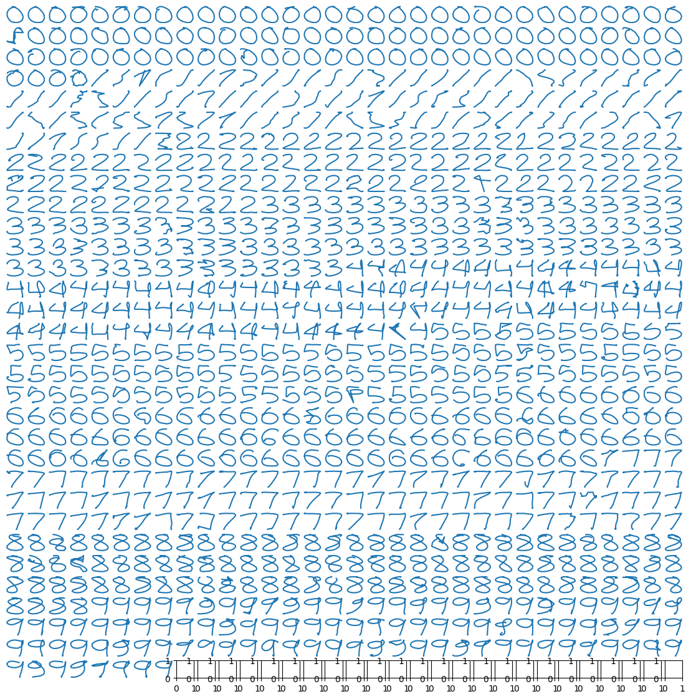

# LeapMotion Classification

Written by: *Samuel, Matej, Tornike*

LUT University - 2023

# Introduction

# Data properties

The leap-motion dataset contains 10 classes. Each class contains exactly 100 samples. Each sample is a sequence of 3-tuples $(x,y,z)$ with variable length. 

[Insert histigram of lengths]

We can see that only very samples have length larger than 100. 

The x,y,z features in each sequence are also not evenly distributed. As we can see in the figure 2, on average, x and y have much more variance than z. 

[Figure 2, shows variances per x, y, z]

Based on this, we compared...

Figure 1 - malformed samples, and vague samples can be seen in 1's and 7's

# Methods

## Deep neural approach

We tried implementing simple convolutional network, using PyTorch, but haven't included this in the final submission function, because of concerns that pytorch wouldn't be readily available on the sumbission system. 

Here we report the results that we got using neural network approaches.

The data processing for CNN involves rasterization, followedd by MinMax scaling to make sure all pixel values fall in `(0, 1)` range. We use negative log-likelyhood loss function between the one-hot encoded label (a size-10 vector) and the network's outputs (unnormalized logits).

In all our experiments we used learning rate of `1e-3`, and batch size of 128 and used SGD with momentum coefficient of 0.9. All the network architectures used convolution stack, followed by global average pooling and two instances of feedforward layers. 

### Findings

- Higher rasterization resolution results in higher performance. This can be explained by seeing the Figure 1. Classes 1 and 7 for example, have very small details that differentiate them. Low-res rasterization destroys these main differentiating features and make classifier unable to differentiate between instances.
- We found that it is beneficial for the initial convolution layer have large receptive field (4, instead of 2). This can be explained by how initial conv layers work. Initial conv layers capture basic shapes (edges, angles, corners). Some of our samples have similarly-shaped samples (see 1s and 7s). We need to differentiate between lines that have near-identical angles. For this, larger receptive field works much better.
- 

# 