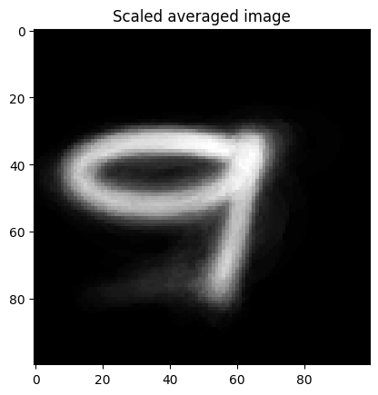
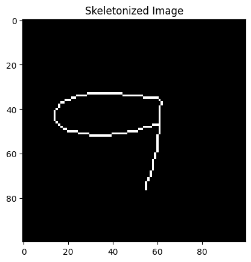
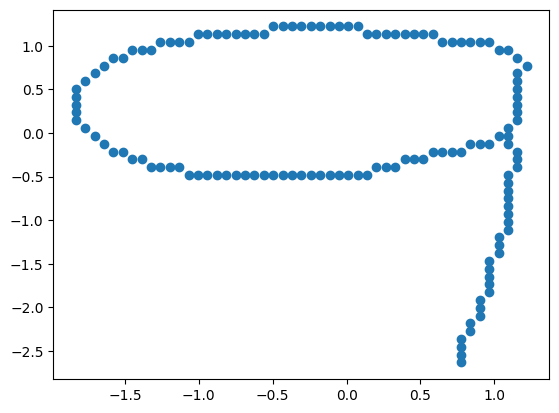

# Comparison of two sets of points
This approach is based on an idea of just working with the sets of points and comparing a sample for classification to templates created from the dataset. Firstly we started with picking the templates by hand from the dataset and comparing a sample to these templates using Hausdorff distance as a metric. Hausdorff distance is a metric that says how much two sets of points differ from each other.

This easy approach resulted in an accuracy of 82.5%. It signalized, that when using better templates this method could be improved. Better templates were obtained with this strategy:

1. Rasterizing images from the set.
2. Averaging pixel values in the set.

3. Skeletonizing averaged image.

4. Converting the skeletonized image to point set.

Each number was converted using this approach with using 90% of the samples from each number set. The remaining 10% were used for testing purposes. However, this method only resulted in 59% accuracy.

Next idea was to change the metric, using KD-tree data structure, we found normalized sum of closest points when comparing sample set of points and template set of points. This metric resulted in 70% accuracy when using choosen templates from dataset and 43% accuracy when using averaged templates.

To sum up the results in a table:
| Templates              | Metric                               | Accuracy in % |
|------------------------|--------------------------------------|---------------|
| Picked from dataset    | Hausdorff distance                   | 82.5          |
| Picked from dataset    | Normalized sum of smallest distances | 70            |
| Averaged               | Hausdorff distance                   | 59            |
| Averaged               | Normalized sum of smallest distances | 43            |

