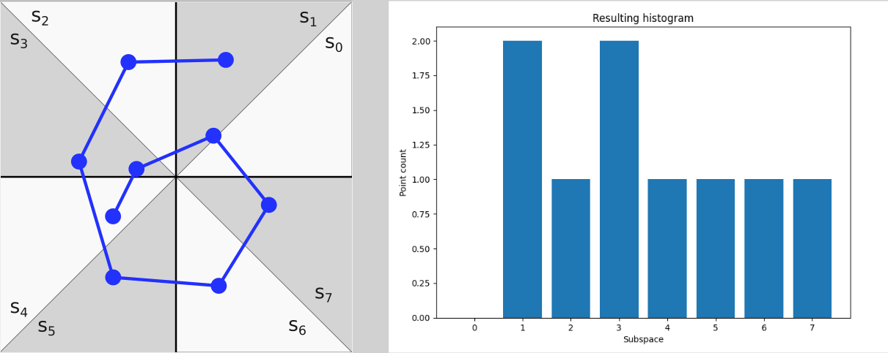
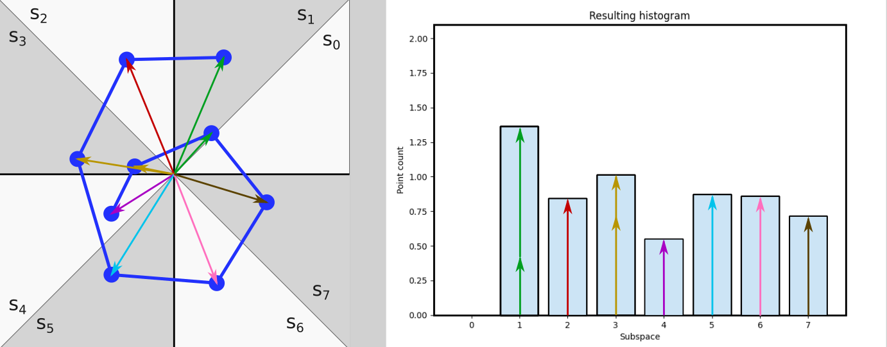
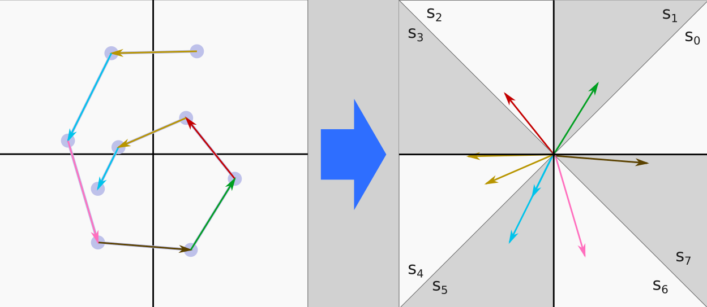

## Feature engineering and classification
One of the ideas for how to approach the problem was to use some kind of feature extraction on the sets of points, which would describe the numbers in a way that makes the feature vectors easily distinguishable and categorizable. While the idea sounds good, a question arises: what kind of features? 

### Feature vector - point vectors
The numbers are described by consecutive points. The points themselves have a location, which can be represented as a vector. Also, every consecutive pair of points is important, because they form a line segment, which is part of the whole number. So what is important is the location of points and the form of line segments. The first thing we tried was to focus just on the location of points. But how to featurize that? 

We could for example divide the space into some discrete subspaces. For each subspace, we would count points belonging to the given subspace and effectively make a histogram of the positions for a given letter. We implemented such an approach, but the subspace division was based on angles instead of actual positions. We figured that this approach would be more resistant to the variability of letters. Granted, this approach is heavily influenced by the actual 3D coordinates of points, and for this reason, it is crucial that the data were scaled to zero mean and standard deviation of one.

|  |
|:--:| 
| *Example of the space division. Subspace s0 contains 0 points, s1 contains 2 points, s2 1 and so on.* |

To further improve these features, we decided that instead of adding 1 to the histogram bin when a point is in the respective subspace, we add the point vector `magnitude` to the bucket. Because the angle is important, but how far from the center point actually is, is important as well. Adding magnitude increased the classification accuracy by 2-3%. So the resulting feature vector ("histogram") looks like this:
|  |
|:--:| 
| *Example of the space division but weighted with vector magnitudes.* |

### Feature vector - line segments
While in theory, the previous approach should be enough for the classification, we also tried to do it a little bit differently. While a single-point position is important, it is not the only thing that makes a letter. What is important as well is local connectivity. The first point is connected to the second, the second to the third and so on. We have decided to encode this information to features in pretty much the same way as described in the previous section, but instead of point vectors, we encoded vectors of neighboring points.

|  |
|:--:| 
| *Visualisation of the transformations of line segments to vectors. After the transformation the same process is applied as previously described.* |

### Classification
In the end, our feature vector was a combination of both approaches. The data were processed in both ways and both of the feature vectors were concatenated into one. Now comes the part of actually classifying them. Since we have transformed the data into a uniform format, we could apply many approaches, like the k-nearest neighbors classifier, k-means classifier etc. However, since none of the mentioned classifiers provided satisfactory results by themselves, we decided to approach the problem differently.

The idea we had was to create "template feature vectors", which would represent something like a "mean number".  Although we did not want to be constrained by just one such template. Thus we used k-means to find as many of these template numbers as needed. For each class in the training set, we have featurized numbers and ran the k-means algorithm to find clusters. The centroid of each cluster was our "template feature vector". How many clusters we needed was determined empirically.

After acquiring the templates, the classification of unknown numbers was a mere calculation of vector similarity. The best measure for this similarity according to our test was Kullback–Leibler divergence. The class of the most similar feature vector was deemed to be a class of the unknown number. This approach yielded an accuracy of 93-94% on the test set.
